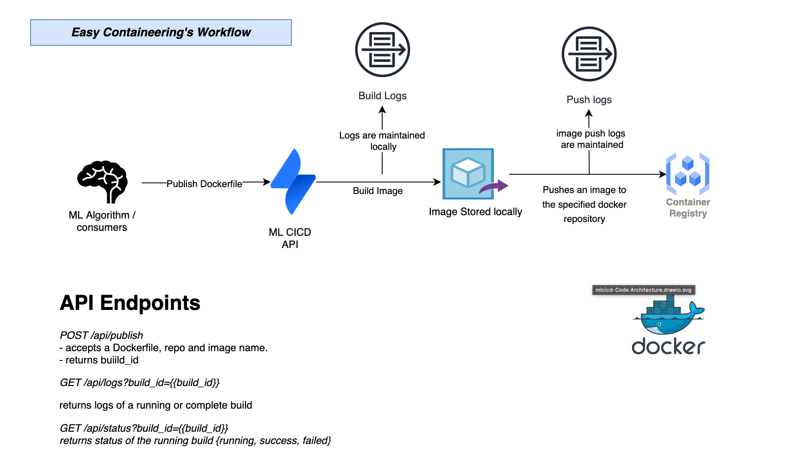

# Image Docker for Machine Learning Model Scripts

This project allows its consumers to encapsulate their scripts at a call of an API Endpoint. 

### Run it in Docker
```
docker build -t mlcicd .
```
Use following command so your local docker daemon can be accessed from within the container

```
docker run -ti -v /var/run/docker.sock:/var/run/docker.sock -e REG_USERNAME={{registryusername}} -e REG_PASSWORD={{registrypassword}} -p 5433:5433 mlcicd
```
### Testing Coverage
> on average, > 80% for actual implementation tests
```
go test -cover ./...
...
ok  	ml-cicd/src/artifacts	0.261s	coverage: 78.6% of statements
ok  	ml-cicd/src/builder	5.092s	coverage: 85.2% of statements
ok  	ml-cicd/src/registry	0.966s	coverage: 93.8% of statements
ok  	ml-cicd/src/utilities	0.539s	coverage: 90.0% of statements
```
# Workflow Diagram



# Code Architecture


# API
### Publish
Allows publlishes a dockerfile to build its image and push it to the docker registry.
```
POST /api/publish
```

### Get Status
Returns status of the build currently running, succeeded or failed.
```
GET /api/status?build_id={{build_id}}
```

### Get Logs
Returns logs or a running or complete image build and push.
```
GET /api/logs?build_id={{build_id}}
```
### Sign in
Allows user to sign in to the API
```
POST /api/signin
username
password
```
### /api/publish 
Allows publlishes a dockerfile to build its image and push it to the docker registry.
```
POST /api/publish
```


POST /api/publish
GET /api/logs?build_id=
GET /api/status?build_id=


